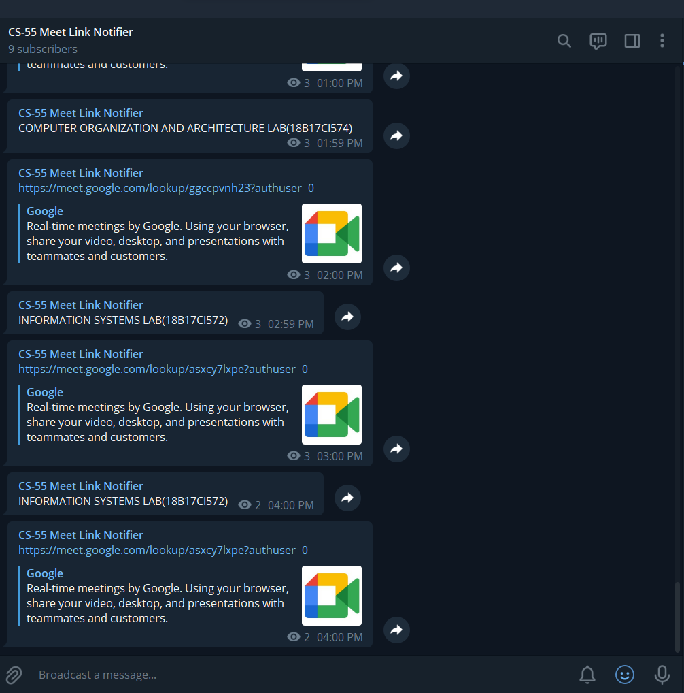

# Meet Link Notifier
This Repo Contains the Python Scripts which can be used for sending Google meet links of classes and LAB.
## Wants To Use without installing i have deployed this application on Heroku.

## Result

